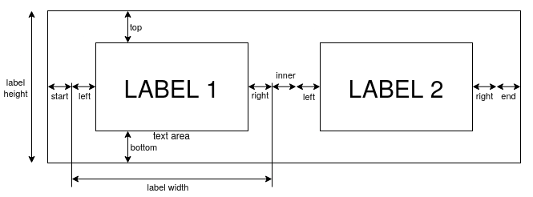

A tool to generate PDFs suitable for printing on a label printer.

Label text is read from a file; each paragraph (separated by newlines) becomes
a separate label.

The output is a single-page PDF, with all labels concatenated, suitable for
printing on a dymo label printer with dymo-cups-drivers.

# label format

Labels are laid out in the following way:



The label height (`--label-height`) is fixed, and should be the width of the tape.

The text area is inset by the margins, including CSS-style
top/right/bottom/left margins defined with `--margin`, an additional margin at
the start/end of the tape (`--margin-start` and `--margin-end`), and an
additional margin between labels (`--margin-inner`).

The text area normally expands to fit the text (after scaling), but can be
fixed with `--label-width`, which includes the left/right margins (but not the
start/end/inner).

The text is laid out in the text area by rendering it with a fixed font size
(set by `--font`) and specified horizontal alignment (`--h-align`), and then
optionally scaling it (`--scale`) to fit the available space (preserving aspect
ratio). Any remaining space in the text area is distributed according to the
horizontal and vertical alignment options (`--h-align` and `--v-align`).

Text is rendered using pango, so for more formatting use [pango
markup](https://docs.gtk.org/Pango/pango_markup.html) in the label text.

Finally, the whole layout is optionally rotated (`--rotate`) to match the
orientation of the tape.

# usage

```shell
mklabels labels.txt labels.pdf 
```

See `mklabels --help` for a list of options. Distance options can be specified
in mm or pt.

Options can be read from a file with an option like `@filename`. Each line can
contain multiple options, and uses shell splitting (so arguments can be
quoted).

This prints something like:

```
print with:
lp -d label -o media=Custom.19x112.42mm labels.pdf
```

Run this command to print the resulting PDF on the printer named "label". I
found that setting the custom media size was absolutely necessary, and not done
by evince.

# install

This uses [cairocffi](https://pypi.org/project/cairocffi) and a CFFI wrapper
around pango/pangocairo, so you will need to have the native
cairo/pango/pangocairo libraries installed.

Otherwise it's a standard python package.

There is also a nix build:

```shell
nix run . -- labels.txt labels.pdf
```

# why?

I often want to make labels which have specific formats (e.g. fixed widths for
parts drawers, or fixed height / size for SMD sample books), long part numbers,
and multiple variations of the same label. I was previously just using
inkscape, which works but is incredibly tedious, and didn't find anything else
which worked well enough.

Writing stuff like this feels like a senseless waste of human life, but the
alternatives are annoying enough that I will just not organise things. So it
goes.

It feels like this could be build on HTML/CSS instead; I spent a while building it with weasyprint though, and in practice found that this added more complexity than it removed. 

# license

see LICENSE.txt

```
mklabel
Copyright (C) 2025  Thomas Nixon

This program is free software: you can redistribute it and/or modify
it under the terms of the GNU Affero General Public License as
published by the Free Software Foundation, either version 3 of the
License, or (at your option) any later version.

This program is distributed in the hope that it will be useful,
but WITHOUT ANY WARRANTY; without even the implied warranty of
MERCHANTABILITY or FITNESS FOR A PARTICULAR PURPOSE.  See the
GNU Affero General Public License for more details.

You should have received a copy of the GNU Affero General Public License
along with this program.  If not, see <https://www.gnu.org/licenses/>.
```
